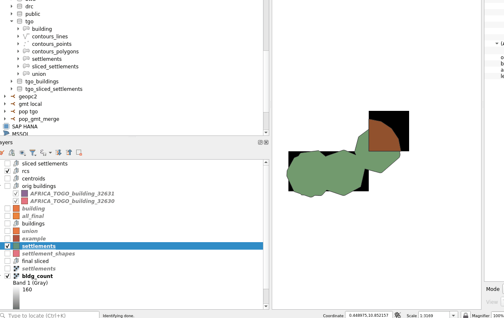
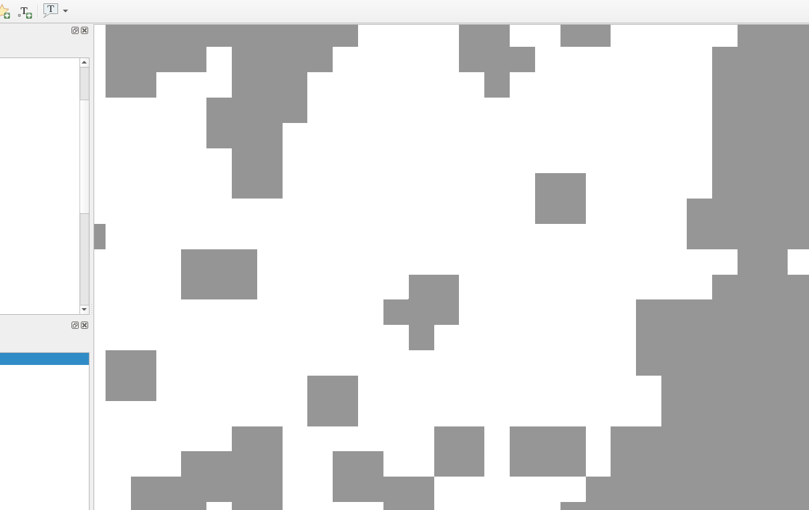

# bldg-agg
Building Aggregation Tools

This repository contains tools/scripts to take as an input building polygons and aggregates them into settlements (a geospatial multipolygon layer).

Module goals:

* Use only open source tools
* Less than a day to run
* Ensure the output are geometrically valid shapes that use linear (not curved) geometries.
* Ensure all buildings are completely contained by a settlement (ensure no settlements overlap)

Novel-T has developed another tool to help merge nearby settlements to each other. This tool is not included in this repository.

# License

This library is released under the [GPLv3 License](./LICENSE.txt)

See https://choosealicense.com/licenses/gpl-3.0/

Two libraries were imported and modified, both under the MIT license:

1. gdal and gdal sys from https://github.com/georust/gdal
2. geos and geos sys from https://github.com/georust/geos

# Building aggregation rules

Buildings will be put in the same settlement if their extents intersect. This is equivalent to the extents having a horizontal and/or vertical distance of <= the grouping distance. This is controlled by the parameter group-distance, and defaults to 0.000833, which is roughly 70 to 90 meters, depending on the proximity to the equator. Once the buildings are grouped, they are all buffered by 50 meters (can be overridden by the command line argument --buffer-meters). This explains why the resulting multipolygon may have multiple polygons. All polygons are then unioned/dissolved. Finally, any inner rings caused by open areas, such as parks or sports fields,  are filled within a settled area. Those polygons are then classified, as described below.


# Classification rules

A settlement type field classifies the settlement multi-polygons in either BUA (Built Up Area), SSA (Small Settlement Area), or Hamlet. Below are the classification rules.

## BUA

A polygon is a BUA if either of the following conditions are fulfilled:
1. The polygon intersects >= 3000 buildings
2. The polygon has population raster values >=13 over an area of >= 400,000m²

## SSA

An SSA has >= 50 buildings and is not a BUA

## Hamlet

Everything else is a hamlet

# Other things to consider

A reference raster is used for various steps. This raster is roughly 90m squares in the 4326 projection.
The building aggregation tool buffers building polygons such that settlements match the building outline.

## Zonal Stats compatibility

We need to ensure that users get consistent results when doing zonal stats using the settlement geometry. The assumption is the raster aligns with the WorldPop reference grids.

This means if a building centroid is in a raster square and that raster square's center does NOT intersect the settlement shape, the settlement will be expanded. The expansion is done by adding a quarter circular shape.  See below to see what this looks like.

Note, this may mean, in certain cases, that 2 settlements that were very close to each other will be merged.  Also, certain polygons (as part of multipolygons) might be merged too.

To give an idea of how many settlements are merged, here are some statistics for NGA:

| First Header         | Settlement Count |
|----------------------|------------------|
| Before corners       | 1,416,852        |
| After corners merged | 1,408,383        |
| Difference           | 8,469 (0.6%)     |




# Environment

Recommended to use WSL2 or a native linux environment.  In windows, docker for windows is required.

# Checking out the code

In WSL2, it is recommended to checkout the code in the WSL2 linux file system.

In WSL1, it is recommended to checkout the code in the windows NTFS file system.

# To Build Docker Images

For WSL2: Start a WSL prompt

<repo>/docker/build.sh

For WSL1: Start a Command Prompt

<repo>/docker/bldg-agg-python/build.bat

# Setting up the data

In step 1, the code will check the inputs and tell you what you need to do.

This will involve putting files in the <repo>/modules/BLDG_AGG or BLDG_CHCEK/input/<3 letter iso code in upper case>

For example, the Nigeria input files would go in

<repo>/modules/BLDG_AGG/input/NGA

This includes a reference raster in

<repo>/modules/BLDG_AGG/input/NGA/ref_raster
and the buildings in
<repo>/modules/BLDG_AGG/input/NGA/buildings

# Running the building aggregation tool

Start a docker prompt.  In WSL2, run

`<repo>/docker/binbash.sh`

In WSL1, run

`<repo>/docker/binbash.bat`


## Running TGO

```
/build/run_bldg_agg.sh BLDG_AGG \
--country TGO \
--group-distance 0.001 \
--contour-value=12 \
--clean \
1 100
```

## Running NGA
```
/build/run_bldg_agg.sh BLDG_AGG \
--country NGA \
--group-distance 0.001 \
--contour-value=12 \
--chunk-rows=15 \
--chunk-cols=15 \
--clean \
1 100
```

## Generating step documentation

This will produce a html document with a list of the step descriptions

```
/build/run_bldg_agg.sh BLDG_AGG --country NGA \
--gen-docs

/build/run_bldg_agg.sh BLDG_CHECK --country NGA \
--gen-docs
```

## Seeing command line help


```
/build/run_bldg_agg.sh BLDG_AGG \
--help
```

## Viewing / converting results in QGIS

The docker container will expose a port, so with QGIS running in the host machine, you can connect with --

host: localhost
db name: bldg_agg
username: postgres
password: postgres
port: 25434

the table name is <country code>.building

## Converting results to a shapefile

Note replace <country code> with the ISO 3 country code in upper case.

Note the results are exported as <GIT REPO>/modules/BLDG_AGG/working/<COUNTRY CODE>/settlements.fgb

If you need another format, please see below for some ogr2ogr commands you can run from within the docker container

```
ogr2ogr \
-f "ESRI Shapefile" \
/tmp/<country code>_output.shp \
"PG: host=db dbname=bldg_agg port=5432 user=postgres password=postgres" \
"<country code>.building" \
-progress \
-nlt MULTIPOLYGON \
-overwrite
```

For example, for tgo --

```
ogr2ogr \
-f "ESRI Shapefile" \
/tmp/tgo_output.shp \
"PG: host=db dbname=bldg_agg port=5432 user=postgres password=postgres" \
"tgo.building" \
-progress \
-nlt MULTIPOLYGON \
-overwrite
```


To check the results contain rows
```
ogrinfo /modules/BLDG_AGG/working/<COUNTRY CODE>/<country code>_output.shp -so <country code>_output
```

```
ogrinfo /modules/BLDG_AGG/working/BWA/bwa_output.shp -so bwa_output
```

## Running zonal stats by hand

First you need to rasterize the vector layer using the same raster you'll use for the zonal stats

Let's assume we want zonal stats on the building aggregation output vs the building count

This is within the docker container (so running `<repo>/docker/binbash.sh`)


NOTE -- The rasterization only needs to be done once.  

WARNING -- Because single hamlets might not cross the center of a raster square, you can consider using the `--all-touched` argument to the burn-polygon-to-raster command.  

See below for the effect it has, not the single hamlet that did not have any matching squares in the rasterized form without `--all-touched`.



```
cd /rust

mkdir -p /modules/BLDG_AGG/working/TGO/zonal_stats

cargo \
run \
--release \
--bin cmdline_tools \
-- \
burn-polygon-to-raster \
--layer-name 'tgo.building' \
--ogr-conn-str "PG: host=db dbname=bldg_agg port=5432 user=postgres password=postgres" \
--snap-raster "/modules/BLDG_AGG/working/TGO/rasters/bldg_count.tif" \
--burn-field id \
--output-raster "/modules/BLDG_AGG/working/TGO/zonal_stats/settlements.tif" \
--clean
```

using all-touched

```
cargo \
run \
--release \
--bin cmdline_tools \
-- \
burn-polygon-to-raster \
--layer-name 'bwa.building' \
--ogr-conn-str "PG: host=db dbname=bldg_agg port=5432 user=postgres password=postgres" \
--snap-raster "/modules/BLDG_AGG/working/BWA/rasters/bldg_count.tif" \
--burn-field id \
--output-raster "/modules/BLDG_AGG/working/BWA/zonal_stats/settlements.tif" \
--clean \
--all-touched
```

Creating zonal stats CSV file

```
cargo \
run \
--release \
--bin zonal_stats \
-- \
--feature-raster \
"/modules/BLDG_AGG/working/TGO/zonal_stats/settlements.tif" \
--data-raster "/modules/BLDG_AGG/working/TGO/rasters/bldg_count.tif" \
--summary-csv "/modules/BLDG_AGG/working/TGO/zonal_stats/bldg_count.csv" \
--clean
```

Note that the CSV contains feature id, # of squares matching, sum of the square values


# Setting up a new country

The building aggregation tool does not require country specific configuration.
